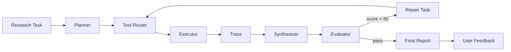

# Insight Harness

面向垂直行业研究的 **Agent Harness Console**。

不是 ChatGPT Clone，而是把研究 Agent 的中间过程做成可控台：

**任务调度 → 工具管控 → 效果观测 → 闭环迭代**

```text
User Task
   ↓
Planner          拆成 3–5 个可执行子任务
   ↓
Tool Router      批准 / 限制 / fallback 工具
   ↓
Executor         web_search / llm / calculator
   ↓
Execution Trace  全程可复盘
   ↓
Synthesizer      汇总成研究报告
   ↓
Evaluator        Completeness / Evidence / Relevance
   ↓
Retry Loop       低分时只补缺口，不整篇重写
   ↓
User Feedback    导出 feedback.csv，服务下一轮迭代
```

## Why Harness

普通链路：

```text
User Task → LLM → Answer   （黑盒）
```

Harness 要解决的是：

| 问题 | Harness 能力 |
|---|---|
| 不知道拆了哪些维度 | 任务调度 · Planner |
| 不知道为何调用工具 | 工具管控 · Tool Router |
| 不知道证据够不够 | 效果观测 · Trace + Evaluator |
| 不知道差结果怎么修 | 闭环迭代 · Retry + Feedback |

## Quick Start

### 1) 本地前端

```bash
python3 -m http.server 8080
```

打开 [http://localhost:8080](http://localhost:8080)

| 模式 | 说明 |
|---|---|
| **Demo Mode** | 本地规则模拟，稳定演示完整链路 |
| **Live Mode** | 经服务端 Proxy 调用 Gemini 2.5 Flash + Google Search Grounding（访客无需填 Key） |

试运行任务：

```text
分析 AI 客服 SaaS 市场是否值得进入
```

### 2) 分享链接也能用 Live（方案 C：服务端 Proxy）

目标：面试官点开 GitHub Pages，**不用填 Key** 就能跑联网版。

```text
Browser (Pages)
   → Cloudflare Worker Proxy
   → Gemini API   ← Key 只存在 Worker Secret
```

部署代理：

```bash
cd worker
npm install
npx wrangler login
npx wrangler secret put GEMINI_API_KEY
npm run deploy
```

把返回的 Worker 地址写入根目录 `config.public.js`：

```js
window.INSIGHT_HARNESS_PUBLIC_CONFIG = {
  proxyUrl: "https://insight-harness-proxy.insight-harness.workers.dev/api/gemini",
  liveModeDefault: true,
};
```

前端不再接收用户 Key；Live Mode 只走 Proxy。然后部署/推送前端（GitHub Pages）。详细说明见 [worker/README.md](./worker/README.md)。

> Gemini Key 只放在 Cloudflare Worker Secret，不要写进前端或提交到 Git。

## Architecture



### 实现映射

| 步骤 | 代码入口 | Demo | Live |
|---|---|---|---|
| Plan | `createPlan()` | 规则模板 | Gemini JSON Planner |
| Route | `routeTool()` | 本地策略 | 本地策略（可控） |
| Execute | `executeTool()` | 模拟证据 | Proxy → Gemini Grounding |
| Synthesize | `createSynthesis()` | 模板报告 | Proxy → Gemini |
| Evaluate | `createEvaluation()` | 规则评分 | Proxy → Gemini Rubric |
| Retry | `runRepairTask()` | 固定补证据 | 按缺口动态补搜 |
| Feedback | localStorage | 导出 CSV | 导出 CSV |

## Harness 四能力（面试一页纸）

1. **任务调度**：Planner 不直接答题，只产出带 `tool / successCriteria` 的任务 JSON  
2. **工具管控**：Router 检查合法性、调用上限、fallback；模型建议 ≠ 直接执行  
3. **效果观测**：Trace 记录每步；Evaluator 用完整度 / 证据度 / 相关性打分  
4. **闭环迭代**：低于 80 分生成 Repair Task，只补缺口；用户反馈可导出沉淀

## Docs

| 文档 | 用途 |
|---|---|
| [PRODUCT_SPEC.md](./PRODUCT_SPEC.md) | 产品规格 |
| [DEMO_SCRIPT.md](./DEMO_SCRIPT.md) | 1/3 分钟演示话术 |
| [worker/README.md](./worker/README.md) | 可分享 Live Proxy 部署 |
| [PLANNER.md](./PLANNER.md) / [PLANNER_PROMPT.md](./PLANNER_PROMPT.md) | 任务调度设计 |
| [TOOL_ROUTER.md](./TOOL_ROUTER.md) | 工具管控 |
| [EXECUTION_TRACE.md](./EXECUTION_TRACE.md) | 过程观测 |
| [EVALUATOR.md](./EVALUATOR.md) / [RETRY_LOOP.md](./RETRY_LOOP.md) | 评分与修复 |

## Project Structure

```text
index.html / styles.css / app.js   # 前端 Console
config.public.js                   # 可提交：proxyUrl
config.local.example.js            # 本机 Key 模板
worker/                            # Cloudflare Worker 代理
PRODUCT_SPEC.md + module docs      # 产品与设计说明
```

## Roadmap

- [x] Gemini 2.5 Flash Planner / Synthesizer / Evaluator  
- [x] Gemini Google Search Grounding  
- [x] 服务端 Proxy，支持分享链接直接 Live  
- [ ] GitHub Pages 在线 Demo  
- [ ] 按垂直行业配置 Evaluator 权重  
